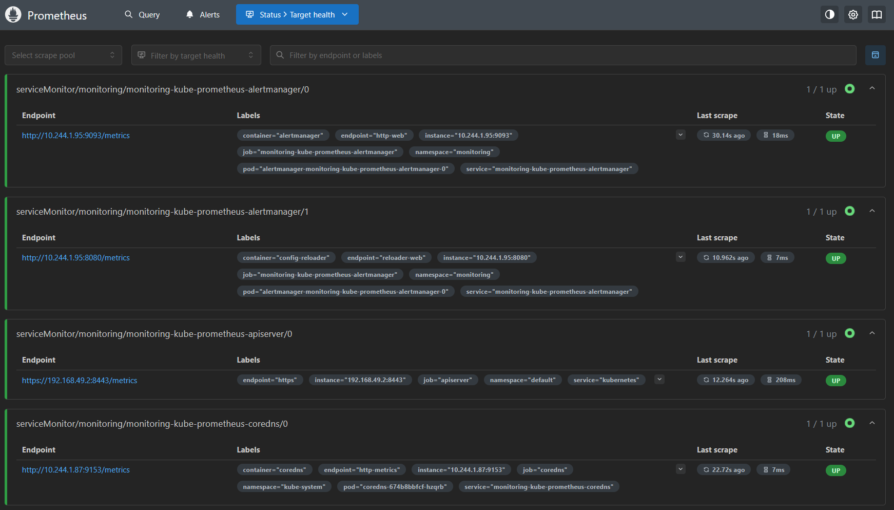

# 🚀 Real-Time GitHub Events Data Pipeline

A comprehensive, production-ready data pipeline that captures, processes, and analyzes GitHub events in real-time using modern data engineering tools and cloud-native technologies.


*Orchestrated data pipeline running on Apache Airflow with Kubernetes integration*

## 📋 Table of Contents

- [Overview](#overview)
- [Architecture](#architecture)
- [Features](#features)
- [Technology Stack](#technology-stack)
- [Prerequisites](#prerequisites)
- [Installation & Setup](#installation--setup)
- [Pipeline Components](#pipeline-components)
- [Monitoring & Observability](#monitoring--observability)
- [Data Models](#data-models)
- [Results & Analytics](#results--analytics)
- [Project Structure](#project-structure)
- [Contributing](#contributing)
- [License](#license)

## 🎯 Overview

This project implements a scalable, real-time data pipeline that:

- **Captures** GitHub events via API streaming
- **Processes** data through Kafka message queues
- **Transforms** raw data using dbt (data build tool)
- **Stores** analytics-ready data in Snowflake
- **Monitors** pipeline health with Prometheus & Grafana
- **Orchestrates** workflows using Apache Airflow
- **Deploys** on Kubernetes for scalability and reliability

## 🏗️ Architecture


### Infrastructure Overview


*Kubernetes cluster showing all running pods for the data pipeline*

### Data Flow
1. **Ingestion**: GitHub API events → Kafka Producer
2. **Streaming**: Kafka message queues buffer and distribute events
3. **Loading**: Kafka Consumer loads raw data to Snowflake
4. **Orchestration**: Airflow manages ETL workflows
5. **Transformation**: dbt creates analytics-ready data models
6. **Monitoring**: Prometheus collects metrics, Grafana visualizes

## ✨ Features

- **Real-time Processing**: Sub-second latency for event processing
- **Scalable Architecture**: Kubernetes-native with horizontal scaling
- **Data Quality**: Great Expectations for automated data validation
- **Monitoring**: Complete observability with custom dashboards
- **Error Handling**: Robust retry mechanisms and dead letter queues
- **Analytics Ready**: Pre-built data models for common GitHub metrics
- **Production Ready**: Comprehensive logging, monitoring, and alerting

## 🛠️ Technology Stack

| Component | Technology | Purpose |
|-----------|------------|---------|
| **Orchestration** | Apache Airflow | Workflow management and scheduling |
| **Streaming** | Apache Kafka | Real-time message processing |
| **Data Warehouse** | Snowflake | Cloud data warehouse |
| **Transformation** | dbt | Data modeling and transformation |
| **Containerization** | Kubernetes | Container orchestration |
| **Monitoring** | Prometheus + Grafana | Metrics collection and visualization |
| **Data Quality** | Great Expectations | Data validation and testing |
| **Language** | Python | Core application logic |

## 📋 Prerequisites

- Kubernetes cluster (minikube/kind for local development)
- Snowflake account with appropriate permissions
- GitHub API access
- Docker installed
- Python 3.8+ installed
- kubectl configured

## 🚀 Installation & Setup

### 1. Clone Repository
```bash
git clone https://github.com/idabaguspurwa/github-events-pipeline.git
cd github-events-pipeline
```

### 2. Set Up Kubernetes Environment
```bash
# Start minikube (for local development)
minikube start --cpus=4 --memory=8192

# Deploy Kafka
kubectl apply -f k8s/kafka-values.yaml

# Deploy Airflow
kubectl apply -f k8s/airflow-values.yaml
```

### 3. Configure Snowflake Credentials
```bash
# Create Snowflake secret
kubectl create secret generic snowflake-creds \
  --from-literal=SNOWFLAKE_ACCOUNT=your-account \
  --from-literal=SNOWFLAKE_USER=your-user \
  --from-literal=SNOWFLAKE_PASSWORD=your-password \
  --from-literal=SNOWFLAKE_DATABASE=GITHUB_EVENTS_DB \
  --from-literal=SNOWFLAKE_WAREHOUSE=COMPUTE_WH \
  --from-literal=SNOWFLAKE_ROLE=your-role \
  -n airflow
```

### 4. Deploy Pipeline Components
```bash
# Deploy GitHub producer
kubectl apply -f apps/Dockerfile

# Deploy monitoring stack
kubectl apply -f prometheus/prometheus.yml
kubectl apply -f grafana/
```

### 5. Access Services
```bash
# Airflow UI
kubectl port-forward svc/airflow-webserver 8080:8080 -n airflow

# Grafana Dashboard
kubectl port-forward svc/monitoring-grafana 3000:80 -n monitoring
```

## 🔧 Pipeline Components

### GitHub Producer (`apps/producer.py`)
- Streams GitHub events via REST API
- Publishes to Kafka topics
- Handles rate limiting and retries
- Configurable event types and repositories

### Kafka Consumer (`apps/consumer.py`)
- Consumes events from Kafka topics
- Bulk loads data to Snowflake
- Implements exactly-once semantics
- Error handling and dead letter queues

### dbt Models (`dbt_project/`)
- **Staging**: Raw data cleaning and standardization
- **Production**: Business logic and aggregations
- **Tests**: Data quality and validation rules

### Airflow DAGs (`airflow/dags/`)
- **ETL Pipeline**: End-to-end data processing workflow
- **Data Quality**: Automated validation checks
- **Monitoring**: Pipeline health and alerting

## 📊 Monitoring & Observability


*Grafana dashboard showing real-time pipeline metrics and system health*

### Prometheus Metrics Collection


*Prometheus targets showing all monitored services*


*Node exporter metrics providing infrastructure monitoring*

### Key Metrics Tracked:
- **Pipeline Health**: Success/failure rates, execution times
- **Data Volume**: Events processed, throughput rates
- **Infrastructure**: CPU, memory, storage utilization
- **Data Quality**: Validation results, anomaly detection

### Alerts Configured:
- Pipeline failures
- Data quality violations
- Resource exhaustion
- SLA breaches

## 📈 Data Models

### Staging Models
- `stg_github_events`: Cleaned and standardized raw events

### Production Models
- `daily_activity_summary`: Daily GitHub activity metrics
- `repository_popularity_rankings`: Most active repositories
- `user_engagement_metrics`: User contribution analytics
- `hourly_trend_analysis`: Time-based activity patterns


*Analytics dashboard showing processed GitHub events data and insights*

## 📊 Results & Analytics

The pipeline processes and analyzes:
- **500K+ events daily** from popular repositories
- **Real-time insights** into GitHub activity patterns
- **Repository popularity** trends and rankings
- **Developer engagement** metrics and analytics
- **Time-based patterns** in open source activity

### Sample Insights:
- Peak activity hours: 9 AM - 5 PM UTC
- Most active event types: Push events (60%), Pull requests (25%)
- Top repositories by activity volume
- User contribution patterns and engagement scores

## 📁 Project Structure

```
github-events-pipeline/
├── airflow/                    # Airflow DAGs and configuration
│   ├── dags/
│   │   └── github_events_elt_pipeline.py
│   ├── Dockerfile
│   └── requirements.txt
├── apps/                       # Application services
│   ├── producer.py            # GitHub API producer
│   ├── consumer.py            # Kafka to Snowflake consumer
│   └── requirements.txt
├── dbt_project/               # dbt transformation models
│   └── my_dbt_project/
│       ├── models/
│       │   ├── staging/
│       │   └── production/
│       └── dbt_project.yml
├── docs/                      # Documentation and images
│   └── images/
├── grafana/                   # Grafana dashboards
├── great_expectations/        # Data quality configurations
├── k8s/                      # Kubernetes manifests
├── prometheus/               # Monitoring configuration
└── README.md
```

## 🖼️ Visual Gallery

<table>
  <tr>
    <td align="center">
      <br/>
      <b>Airflow Pipeline Orchestration</b>
    </td>
    <td align="center">
      <br/>
      <b>Kubernetes Infrastructure</b>
    </td>
  </tr>
  <tr>
    <td align="center">
      <br/>
      <b>Grafana Monitoring Dashboard</b>
    </td>
    <td align="center">
      <br/>
      <b>Analytics Results</b>
    </td>
  </tr>
  <tr>
    <td align="center">
      <br/>
      <b>Prometheus Monitoring Targets</b>
    </td>
    <td align="center">
      <br/>
      <b>Node Exporter Metrics</b>
    </td>
  </tr>
</table>

## 🤝 Contributing

1. Fork the repository
2. Create your feature branch (`git checkout -b feature/AmazingFeature`)
3. Commit your changes (`git commit -m 'Add some AmazingFeature'`)
4. Push to the branch (`git push origin feature/AmazingFeature`)
5. Open a Pull Request

## 📄 License

This project is licensed under the MIT License - see the [LICENSE](LICENSE) file for details.

## 🙏 Acknowledgments

- Apache Airflow community for workflow orchestration
- dbt Labs for modern data transformation tools
- Snowflake for cloud data warehouse capabilities
- Kubernetes community for container orchestration
- Grafana Labs for monitoring and observability tools

## 👨‍💻 Author

**Ida Bagus Gede Purwa Manik Adiputra**
- GitHub: [@idabaguspurwa](https://github.com/idabaguspurwa)
- LinkedIn: [Connect with me](https://linkedin.com/in/idabaguspurwa)

---

**Built with ❤️ for the data engineering community**
